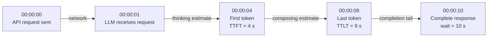
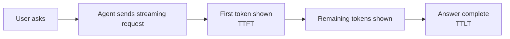
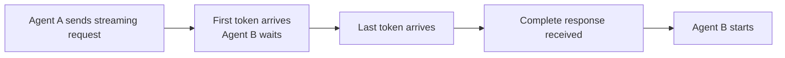
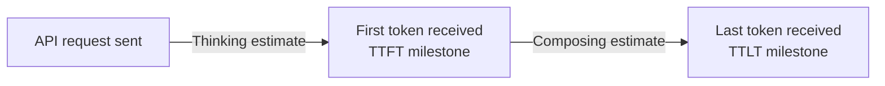
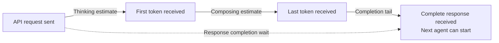

# Azure OpenAI LLM Timing Benchmark

这个 benchmark 回答一个简单的问题：

> **发送 API request 后，consumer 需要等待多长时间，这些时间分别消耗在哪里？**

consumer 可以是用户，也可以是另一个 Agent。两者都会接收 Streaming output，但使用方式不同。

## 简化的 timing model

本例使用五个 event：

| Clock | Event | 含义 |
| --- | --- | --- |
| `00:00:00` | API request sent | timer 开始计时。 |
| `00:00:01` | LLM receives the request | request 已通过 network。 |
| `00:00:04` | First token received | 用户或 Agent 可以看到第一段 output。 |
| `00:00:09` | Last token received | 所有可见 output 已到达。 |
| `00:00:10` | Complete API response received | caller 已收到完整 response。 |

Clock value 用于标识 event。TTFT 和 TTLT 都是从 `00:00:00` 的 API send time 开始计算的 duration。



### TTFT：thinking estimate

**Time To First Token (TTFT)** 是从发送 API request 到收到 first token 的时间。

在本例中：

$$
TTFT = 00{:}00{:}04 - 00{:}00{:}00 = 4\text{ seconds}
$$

为便于比较，本文将 TTFT 称为 **thinking estimate**。

图中显示 LLM 在一秒后收到 request。如果减去图示的 network time，从 LLM 收到 request 到
first token 的间隔为三秒。client benchmark 无法可靠地分离这段时间，因此报告可观测到的
四秒 TTFT。

### TTLT - TTFT：composing estimate

**Time To Last Token (TTLT)** 是从发送 API request 到收到最后一个可见 token 的时间。

在本例中，TTLT 为九秒。first token 与 last token 之间的时间为：

$$
TTLT - TTFT = 9 - 4 = 5\text{ seconds}
$$

本文将这五秒称为 **composing estimate**。

### Response completion wait

完整 API response 在 `00:00:10` 到达，因此总 completion wait 为：

$$
00{:}00{:}10 - 00{:}00{:}00 = 10\text{ seconds}
$$

在本例中，TTLT 与 response completion wait 不同：

- TTLT 为 9 秒，因为最后一个可见 token 在 `00:00:09` 到达。
- Response completion wait 为 10 秒，因为完整 response 在 `00:00:10` 到达。

### 为什么简化 network time

Microsoft 发布了 Azure region 之间通信的
[Azure network round-trip latency statistics](https://learn.microsoft.com/en-us/azure/networking/azure-network-latency?tabs=Americas%2CWestUS#round-trip-latency-data-by-region)。
该页面报告在 30 天窗口内收集的方向性 monthly P50 round-trip measurement。许多公开值远低于
300 ms，但部分 region pair 高于 300 ms。这些统计数据描述典型的 measured latency，并非保证的上限。

本例特意使用较宽松的一秒 network interval，以便清楚展示 event 顺序。在简化的 benchmark
说明中，我们不会从 TTFT 或其他 client-observed duration 中减去 network time。

> **本文使用的简化定义**
>
> - Thinking estimate = TTFT
> - Composing estimate = TTLT - TTFT
> - Response completion wait = API send to complete API response
>
> 这些只是用于比较的简化 label，并不是 LLM 内部的直接 measurement。

## Pattern 1：user-to-agent streaming

用户可以在 first token 出现后立即开始阅读。



对用户而言，TTFT 很重要，因为它标志着何时可以开始阅读。composing estimate 表示其余可见
answer 需要多长时间才能到达。

## Pattern 2：agent-to-agent streaming

另一个 Agent 通常需要完整 context 才能开始执行任务。



first token 通常无法帮助 Agent B。Agent A 获得完整 response 后，Agent B 才开始执行。

> **为什么两个 pattern 都使用 Streaming 进行 benchmark？**
>
> Streaming 通常不适合作为 Agent 之间的提前启动机制，因为下一个 Agent 需要完整 context。
> 我们仍然使用 Streaming 对两个 pattern 进行 benchmark，使 user-to-agent 与
> agent-to-agent result 使用相同的衡量标准。
>
> 这是一种 measurement 选择，并不建议 Agent 根据 partial output 开始执行。

| Pattern | consumer 何时获益 | 最重要的 measurement |
| --- | --- | --- |
| User-to-agent | first token 到达时，因为用户可以开始阅读 | TTFT、composing estimate 和 TTLT |
| Agent-to-agent | 完整 response 到达后，因为下一个 Agent 需要完整 context | Thinking estimate、composing estimate 和 response completion wait |

## 一次 run 生成两份 report

每次 benchmark run 使用同一组 Streaming measurement，并在 `reports/` 子目录下写入两份具有
相同 run timestamp 的 report：

- `reports/benchmark-user-to-agent-HHMM-YYYYMMDD.html`
- `reports/benchmark-agent-to-agent-HHMM-YYYYMMDD.html`

两份 report 使用的 measurement 不变，只有 audience、ranking metric、table、workflow 和
chart 的侧重点不同。

### Report view 1：user-to-agent streaming

面向用户的 report 展示以下 timing flow：



chart 标记：

- **Thinking estimate：** 从 API send 到 first token。
- **Composing estimate：** 从 first token 到 last token。
- **TTFT：** thinking segment 结束时的 milestone。
- **TTLT：** composing segment 结束时的 milestone。

TTFT 和 thinking estimate 描述的是同一个 first segment，不能将两者相加。

### Report view 2：agent-to-agent streaming

面向 Agent 的 report 强调下一个 Agent 启动前的总等待时间：



diagram 和 chart 重点展示：

- **Thinking estimate：** first token 到达前的时间。
- **Composing estimate：** 从 first token 到 last token 的时间。
- **Response completion wait：** 从 API send 到完整 response 的全部等待时间。

completion wait 是 agent-to-agent 的主要比较指标，因为下一个 Agent 无法仅凭 first token
开始执行。

## Benchmark 比较什么

对于每个 workload，应结合阅读以下 result：

| Result | 简单含义 |
| --- | --- |
| **Usable response rate** | model 返回 workflow 可用的完整 response 的频率。 |
| **Average time** | usable response 的一般等待时间。 |
| **P95 time** | slow-case 值：95% 的 usable response 会在此时间内完成。 |

比较 model 时应使用相同的 prompt、token limit、Azure region 和 Streaming path。不同
workload 应分别比较。

## Quick start

要求：Python 3.10 或更高版本、Azure CLI、Azure OpenAI resource 的访问权限，以及
**Cognitive Services OpenAI User** role。

```powershell
# Create and activate the local Python environment
python -m venv .venv
.\.venv\Scripts\Activate.ps1

# Install dependencies
python -m pip install -r requirements.txt

# Sign in to the tenant that owns the Azure OpenAI resource
az login --tenant <tenant-id> --use-device-code

# Edit config.yaml, then run the benchmark
python benchmark.py --config config.yaml --out .
```

Streaming 始终启用，不提供 response-mode setting。

在 `config.yaml` 中设置 measured iteration 数量（默认值：10）：

```yaml
iterations: 10
```

该数量适用于每个 model/template pair。每个 pair 会额外执行一次 warm-up request，且不计入
statistics。query 按照每个 template 中列出的顺序选择；如果 `iterations` 超过 query count，
则从第一个 query 重新开始。

无需访问 Azure 即可重新生成两份 illustrative report：

```powershell
python benchmark.py --render-summary sample-streaming-summary.json `
  --report-timestamp 1800-20260820 --out .
```

benchmark 会在指定的 `--out` directory 下自动创建 `reports/` 和 `rawdata/`。Offline
`--render-summary` run 只创建 `reports/`。

## Configuration

| Setting | 含义 |
| --- | --- |
| `endpoint` | Azure OpenAI resource address |
| `api_version` | Chat Completions API version |
| `tenant_id` | 登录时使用的 Microsoft Entra tenant |
| `token_budget` | 每个 request 最多生成的 token 数量 |
| `request_timeout_s` | request timeout，单位为秒 |
| `iterations` | 每个 model/template 的 measured request 数量；默认值为 10 |
| `models` | 要比较的 Azure deployment name |
| `templates` | 要运行的 prompt workload |

## 内置 workload

- `prompt-template-routing.yaml` 要求每个 model 为 request 选择正确的 downstream Agent。
- `prompt-template-reasoning.yaml` 要求每个 model 对问题进行 reasoning 并返回 answer。

每个 template 还描述预期的 response shape。只有完整且符合该 shape 的 response 才算 usable，
以防止快速但错误的 response 被视为成功 result。

列出的 query 构成可复用的 pool，而不是固定 iteration count。例如，设置 `iterations: 12`
且 template 包含 10 个 query 时，会先运行 query 1 到 10，再次运行 query 1 和 2。

## Output file

每次 run 会写入以下 file：

| File | 用途 |
| --- | --- |
| `reports/benchmark-user-to-agent-HHMM-YYYYMMDD.html` | 面向用户的 TTFT、composing 和 TTLT report |
| `reports/benchmark-agent-to-agent-HHMM-YYYYMMDD.html` | 面向 Agent 的 complete-response wait report |
| `rawdata/summary.json` | 按 workload 和 model 汇总的 result |
| `rawdata/raw-results.jsonl` | 每个 warm-up 和 measured request 对应一行 |
| `rawdata/benchmark.log` | run progress 和 error |
| `sample-streaming-summary.json` | 用于 offline report rendering 的 deterministic illustrative input |

仓库中的 [User-to-Agent sample report](reports/benchmark-user-to-agent-1800-20260820.html)
和 [Agent-to-Agent sample report](reports/benchmark-agent-to-agent-1800-20260820.html)
是 illustrative example，并非真实的 Azure benchmark result。

## Technical reference

- request 逐个执行，因此 benchmark 测量的是 latency 而不是 throughput。
- 每个 model/template 执行 `iterations` 次 measured request；默认值为 10。
- measured request 前会额外执行一次 warm-up request，且不计入 statistics。
- API call 总数等于 `models × templates × (iterations + 1 warm-up)`。
- Authentication 在 request timing 开始前完成。
- 所有 request 复用同一个 persistent HTTP client。
- Streaming 分别记录 first-token time、last-visible-token time 和 response completion。
  `[DONE]` event 表示 stream 完成。
- model 报告的 token usage 可能包含 hidden reasoning token。
- benchmark 检查 response structure，不检查 answer 在事实层面是否正确。

## Troubleshooting

| Problem | 检查项 |
| --- | --- |
| Sign-in fails | 运行 `az login --tenant <tenant-id> --use-device-code` |
| HTTP 401 or 403 | 验证 Cognitive Services OpenAI User role |
| HTTP 404 | 验证 Azure deployment name 和 API version |
| HTTP 400 | 检查所选 model setting 和 token parameter |
| Output is not usable | 确保 model 返回 template 要求的 response format |
| Request times out | 检查 deployment health、prompt size、token budget 和 timeout |
| Need reports without an Azure call | 对已有 summary JSON 使用 `--render-summary` |

## Test

test 使用 simulated HTTP response，不会调用 Azure：

```powershell
.\.venv\Scripts\Activate.ps1
python -m unittest -v test_benchmark.py
```

test 覆盖 sign-in check、model request setting、Streaming completion、timing invariant、
response usability、audience-specific ranking 和 offline dual-report generation。

## 如何阅读 report

> **重点：** benchmark 只需运行一次，即可获得两份 HTML report file。每份 file 都包含两个
> workload 的 result，因此共有四种 workload-and-audience 组合。请选择与 use case 匹配的组合。

两份 sample report 如下：

- [User-to-Agent Streaming Benchmark Report](https://denlai-mshk.github.io/azure-openai-streaming-latency-benchmark/reports/benchmark-user-to-agent-1654-20260821.html)
- [Agent-to-Agent Streaming Benchmark Report](https://denlai-mshk.github.io/azure-openai-streaming-latency-benchmark/reports/benchmark-agent-to-agent-1654-20260821.html)

首先选择 workload，然后根据 response 的 consumer 选择对应的 report：

| 组合 | 适用场景 | 重点关注 |
| --- | --- | --- |
| **Query routing + Agent-to-Agent** | 一个 Agent 将 request 路由给另一个 Agent，而后者需要获得完整的 routing decision 才能开始执行。 | Response completion wait 和 completion tail |
| **Reasoning + Agent-to-Agent** | 一个 Agent 完成 reasoning task 后，另一个 Agent 才能使用完整 answer。 | Response completion wait 和 completion tail |
| **Query routing + User-to-Agent** | 用户在 streamed routing 或 classification response 到达时开始阅读。 | TTFT、composing estimate 和 TTLT |
| **Reasoning + User-to-Agent** | 用户在 streamed reasoning response 到达时开始阅读。 | TTFT、composing estimate 和 TTLT |

两份 report 使用同一次 benchmark run 和同一组 Streaming measurement。User-to-Agent report
强调用户何时可以开始阅读，以及可见 answer 何时完成。Agent-to-Agent report 强调
complete-response wait，因为下一个 Agent 通常需要完整 context 才能开始执行。
