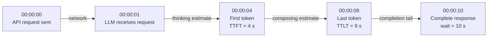
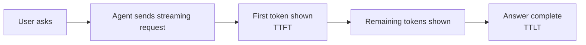
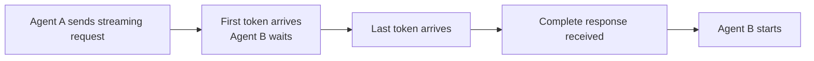
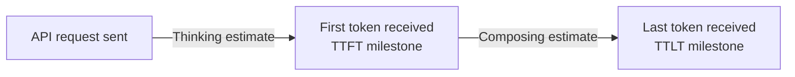
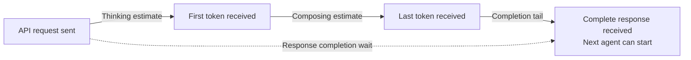

# Azure OpenAI LLM Timing Benchmark

This benchmark asks one simple question:

> **After an API request is sent, how long does the consumer wait, and where is that time spent?**

The consumer can be a person or another agent. Both receive streamed output, but they
use it differently.

## The simple timing model

We use five events in this example:

| Clock | Event | Meaning |
| --- | --- | --- |
| `00:00:00` | API request sent | The timer starts. |
| `00:00:01` | LLM receives the request | The request has crossed the network. |
| `00:00:04` | First token received | The user or agent can see the first output. |
| `00:00:09` | Last token received | All visible output has arrived. |
| `00:00:10` | Complete API response received | The caller has received the completed response. |

The clock values identify events. TTFT and TTLT are durations measured from the API
send time at `00:00:00`.



### TTFT: thinking estimate

**Time To First Token (TTFT)** is the time from sending the API request until receiving
the first token.

In the example:

$$
TTFT = 00{:}00{:}04 - 00{:}00{:}00 = 4\text{ seconds}
$$

For a simple comparison, this document calls TTFT the **thinking estimate**.

The diagram shows one second before the LLM receives the request. If that illustrated
network time were subtracted, the interval from LLM receipt to first token would be
three seconds. The client benchmark cannot separate that interval reliably, so it
reports the observable four-second TTFT.

### TTLT - TTFT: composing estimate

**Time To Last Token (TTLT)** is the time from sending the API request until receiving
the last visible token.

In the example, TTLT is nine seconds. The time between the first and last token is:

$$
TTLT - TTFT = 9 - 4 = 5\text{ seconds}
$$

This document calls those five seconds the **composing estimate**.

### Response completion wait

The complete API response arrives at `00:00:10`, so the total completion wait is:

$$
00{:}00{:}10 - 00{:}00{:}00 = 10\text{ seconds}
$$

TTLT and response completion wait are different in this example:

- TTLT is 9 seconds because the last visible token arrives at `00:00:09`.
- Response completion wait is 10 seconds because the completed response arrives at
  `00:00:10`.

### Why network time is simplified

Microsoft publishes [Azure network round-trip latency statistics](https://learn.microsoft.com/en-us/azure/networking/azure-network-latency?tabs=Americas%2CWestUS#round-trip-latency-data-by-region)
for communication between Azure regions. The page reports directional monthly P50
round-trip measurements collected over a 30-day window. Many published values are well
below 300 ms, although some region pairs are above 300 ms. These statistics describe
typical measured latency; they are not a guaranteed maximum.

This example uses a deliberately generous one-second network interval so the event
order is easy to see. For the simplified benchmark explanation, we do not subtract
network time from TTFT or the other client-observed durations.

> **Simple definitions used in this document**
>
> - Thinking estimate = TTFT
> - Composing estimate = TTLT - TTFT
> - Response completion wait = API send to complete API response
>
> These are simple comparison labels, not direct measurements inside the LLM.

## Pattern 1: user-to-agent streaming

A person can start reading as soon as the first token appears.



For the user, TTFT matters because it marks when reading can begin. The composing
estimate describes how long the remaining visible answer takes to arrive.

## Pattern 2: agent-to-agent streaming

Another agent normally needs the complete context before it can start its task.



The first token does not usually help Agent B. Agent B starts after Agent A has the
complete response.

> **Why benchmark both patterns with streaming?**
>
> Streaming is usually not useful as an early-start mechanism between agents because
> the next agent needs complete context. We still benchmark both patterns with
> streaming so user-to-agent and agent-to-agent results use the same ruler.
>
> This is a measurement choice. It is not a recommendation that an agent should act on
> partial output.

| Pattern | When the consumer benefits | Most important measurements |
| --- | --- | --- |
| User-to-agent | At the first token, because the user can begin reading | TTFT, composing estimate, and TTLT |
| Agent-to-agent | After the complete response, because the next agent needs full context | Thinking estimate, composing estimate, and response completion wait |

## Two reports from one run

Every benchmark run uses one set of streaming measurements and writes two presentations
with the same run timestamp under the `reports/` subfolder:

- `reports/benchmark-user-to-agent-HHMM-YYYYMMDD.html`
- `reports/benchmark-agent-to-agent-HHMM-YYYYMMDD.html`

The measurements do not change between reports. Only the audience, ranking metric,
table, workflow, and chart emphasis change.

### Report view 1: user-to-agent streaming

The user-facing report shows this timing flow:



The chart marks:

- **Thinking estimate:** API send to first token.
- **Composing estimate:** first token to last token.
- **TTFT:** the milestone at the end of the thinking segment.
- **TTLT:** the milestone at the end of the composing segment.

TTFT and thinking estimate describe the same first segment. They must not be added
together.

### Report view 2: agent-to-agent streaming

The agent-facing report emphasizes the total wait before the next agent can
start:



The diagram and chart focus on:

- **Thinking estimate:** time before the first token.
- **Composing estimate:** time from first token to last token.
- **Response completion wait:** the full wait from API send to complete response.

The completion wait is the primary agent-to-agent comparison because the next agent
cannot start from the first token alone.

## What the benchmark compares

For each workload, read these results together:

| Result | Plain meaning |
| --- | --- |
| **Usable response rate** | How often the model returns a complete response that the workflow can use. |
| **Average time** | The ordinary wait across usable responses. |
| **P95 time** | A slow-case value: 95% of usable responses finish within this time. |

Compare models using the same prompt, token limit, Azure region, and streaming path.
Different workloads should be compared separately.

## Quick start

Requirements: Python 3.10 or later, Azure CLI, access to an Azure OpenAI resource, and
the **Cognitive Services OpenAI User** role.

```powershell
# Create and activate the local Python environment
python -m venv .venv
.\.venv\Scripts\Activate.ps1

# Install dependencies
python -m pip install -r requirements.txt

# Sign in to the tenant that owns the Azure OpenAI resource
az login --tenant <tenant-id> --use-device-code

# Edit config.yaml, then run the benchmark
python benchmark.py --config config.yaml --out .
```

Streaming is always enabled; there is no response-mode setting.

Set the measured iteration count in `config.yaml` (default: 10):

```yaml
iterations: 10
```

This count applies to every model/template pair. One additional warm-up request runs
for each pair and is excluded from statistics. Queries are selected from each
template in listed order; if `iterations` exceeds the query count, selection starts
again from the first query.

To regenerate both illustrative reports without Azure access:

```powershell
python benchmark.py --render-summary sample-streaming-summary.json `
  --report-timestamp 1800-20260820 --out .
```

The benchmark creates `reports/` and `rawdata/` automatically beneath the selected
`--out` directory. Offline `--render-summary` runs create only `reports/`.

## Configuration

| Setting | Meaning |
| --- | --- |
| `endpoint` | Azure OpenAI resource address |
| `api_version` | Chat Completions API version |
| `tenant_id` | Microsoft Entra tenant used for sign-in |
| `token_budget` | Maximum generated tokens per request |
| `request_timeout_s` | Request timeout in seconds |
| `iterations` | Measured requests per model/template; defaults to 10 |
| `models` | Azure deployment names to compare |
| `templates` | Prompt workloads to run |

## Included workloads

- `prompt-template-routing.yaml` asks each model to select the correct downstream
  agent for a request.
- `prompt-template-reasoning.yaml` asks each model to reason through a problem and
  return an answer.

Each template also describes the expected response shape. A response counts as usable
only when it is complete and matches that shape. This prevents a fast but broken
response from being treated as a successful result.

The listed queries form a reusable pool rather than fixing the iteration count. For
example, `iterations: 12` with 10 template queries runs queries 1 through 10, then
queries 1 and 2 again.

## Output files

A run writes these files:

| File | Purpose |
| --- | --- |
| `reports/benchmark-user-to-agent-HHMM-YYYYMMDD.html` | User-focused TTFT, composing, and TTLT report |
| `reports/benchmark-agent-to-agent-HHMM-YYYYMMDD.html` | Agent-focused complete-response wait report |
| `rawdata/summary.json` | Results summarized by workload and model |
| `rawdata/raw-results.jsonl` | One row for every warm-up and measured request |
| `rawdata/benchmark.log` | Run progress and errors |
| `sample-streaming-summary.json` | Deterministic illustrative input for offline report rendering |

The checked-in [User-to-Agent sample report](reports/benchmark-user-to-agent-1800-20260820.html)
and [Agent-to-Agent sample report](reports/benchmark-agent-to-agent-1800-20260820.html)
are illustrative examples, not live Azure benchmark results.

## Technical reference

- Requests run one at a time so the benchmark measures latency rather than throughput.
- `iterations` measured requests run per model/template; the default is 10.
- One additional warm-up request runs before measured requests and is excluded from
  statistics.
- Total API calls equal `models × templates × (iterations + 1 warm-up)`.
- Authentication finishes before request timing starts.
- The same persistent HTTP client is reused across requests.
- Streaming records first-token time, last-visible-token time, and response completion
  separately. The `[DONE]` event marks a complete stream.
- Model-reported token usage may include hidden reasoning tokens.
- The benchmark checks response structure, not whether the answer is factually correct.

## Troubleshooting

| Problem | Check |
| --- | --- |
| Sign-in fails | Run `az login --tenant <tenant-id> --use-device-code` |
| HTTP 401 or 403 | Verify the Cognitive Services OpenAI User role |
| HTTP 404 | Verify the Azure deployment name and API version |
| HTTP 400 | Check the selected model settings and token parameters |
| Output is not usable | Ensure the model returns the response format requested by the template |
| Request times out | Review deployment health, prompt size, token budget, and timeout |
| Need reports without an Azure call | Use `--render-summary` with an existing summary JSON |

## Tests

Tests use simulated HTTP responses and do not call Azure:

```powershell
.\.venv\Scripts\Activate.ps1
python -m unittest -v test_benchmark.py
```

They cover sign-in checks, model request settings, streaming completion, timing
invariants, response usability, audience-specific ranking, and offline dual-report
generation.

## How to read the report

> **Focus point:** Run the benchmark once and you get two HTML report files. Each file
> contains results for both workloads, giving you four workload-and-audience
> combinations. Pick the combination that matches your use case.

The two sample reports are:

- [User-to-Agent Streaming Benchmark Report](reports/benchmark-user-to-agent-1800-20260820.html)
- [Agent-to-Agent Streaming Benchmark Report](reports/benchmark-agent-to-agent-1800-20260820.html)

Choose the workload first, then choose who consumes the response:

| Combination | Use it when | Focus on |
| --- | --- | --- |
| **Query routing + Agent-to-Agent** | One agent routes a request to another agent, which needs the complete routing decision before it can start. | Response completion wait and completion tail |
| **Reasoning + Agent-to-Agent** | One agent completes a reasoning task before another agent can use the full answer. | Response completion wait and completion tail |
| **Query routing + User-to-Agent** | A user reads a streamed routing or classification response as it arrives. | TTFT, composing estimate, and TTLT |
| **Reasoning + User-to-Agent** | A user reads a streamed reasoning response as it arrives. | TTFT, composing estimate, and TTLT |

Both reports use the same benchmark run and the same streaming measurements. The
User-to-Agent report emphasizes when a person can start reading and when the visible
answer finishes. The Agent-to-Agent report emphasizes the complete-response wait
because the next agent normally needs the full context before it can start.
